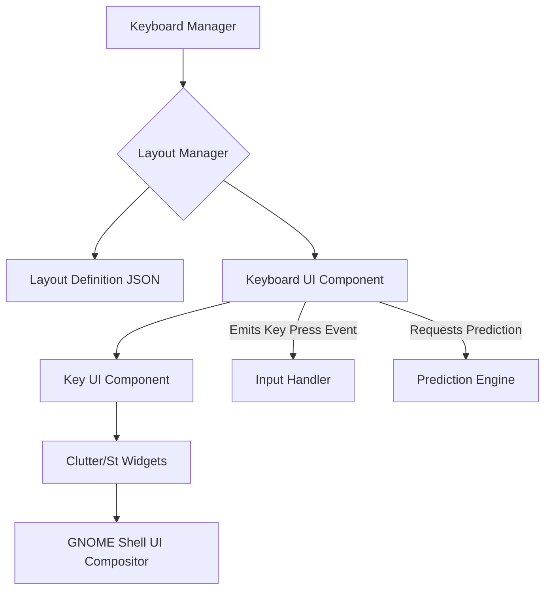
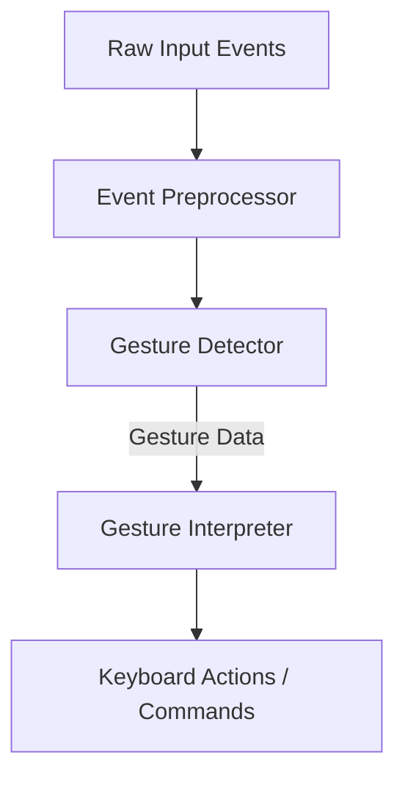
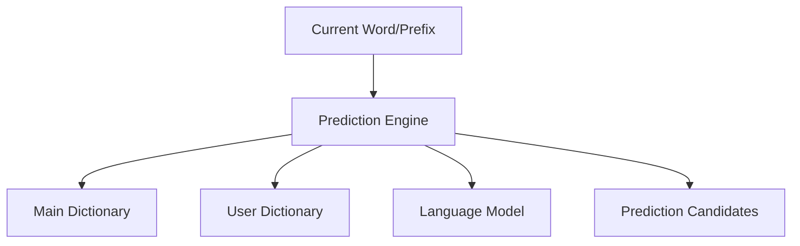

# GNOME Shell Virtual Keyboard Extension - Technical Specification

**Document Version:** 1.0
**Target Platform:** GNOME Shell on Linux tablets/touch devices
**Primary Input Method:** Touch input with mouse/keyboard fallback support
**Architecture Goal:** Modular, extensible, production-grade design supporting phased implementation of basic and advanced features.

---

## 1. Project Structure & Organization

This section outlines the proposed directory layout, module organization, file naming conventions, and code organization patterns for the GNOME Shell virtual keyboard extension.

```
.
├── extension.js                # Main entry point of the extension
├── prefs.js                    # GSettings preferences UI
├── README.md                   # Project README
├── CHANGELOG.md                # Change log
├── LICENSE                     # License file
├── schemas/                    # GSettings XML schemas
│   └── org.gnome.shell.extensions.betterkeys.gschema.xml
├── src/                        # Core source code for the keyboard
│   ├── ui/                     # User Interface components (Clutter/St widgets)
│   │   ├── keyboard.js         # Main keyboard rendering and layout
│   │   ├── key.js              # Individual key rendering and states
│   │   ├── theming.js          # Theming engine and styles
│   │   └── components/         # Reusable UI components (e.g., candidate bar, overlay)
│   ├── input/                  # Input event handling and gesture recognition
│   │   ├── handler.js          # Core input event dispatcher
│   │   └── gestures.js         # Gesture recognition module
│   ├── prediction/             # Predictive text engine
│   │   ├── engine.js           # Main prediction logic
│   │   ├── models/             # Machine learning models (if applicable)
│   │   └── dictionary.js       # User dictionary management
│   ├── settings/               # GSettings integration and management
│   │   └── manager.js          # Wrapper for GSettings access
│   ├── utils/                  # Utility functions
│   │   ├── logger.js           # Logging utility
│   │   └── helpers.js          # General helper functions
│   └── main.js                 # Orchestrates core modules
├── data/                       # Static data (e.g., default layouts, emoji data)
│   ├── layouts/                # Keyboard layout definitions (e.g., QWERTY, AZERTY)
│   └── emojis/                 # Emoji data
├── test/                       # Unit and integration tests
│   ├── unit/
│   ├── integration/
│   └── mocks/
├── .gitignore
├── meson.build                 # Meson build system configuration
├── dist/                       # Build output directory
└── translations/               # Localization files
```

**Module Organization:**

*   **[`extension.js`](extension.js):** The primary entry point for the GNOME Shell extension, responsible for initialization and deinitialization.
*   **[`prefs.js`](prefs.js):** Handles the GSettings preferences user interface, allowing users to configure the keyboard.
*   **[`schemas/`](schemas/):** Contains XML files defining the GSettings schemas for persistent user preferences.
*   **[`src/`](src/):** The core logic of the virtual keyboard.
    *   **[`ui/`](src/ui/):** Manages all visual aspects of the keyboard, including rendering, layout, and theming.
        *   **[`keyboard.js`](src/ui/keyboard.js):** Orchestrates the rendering of the entire keyboard, manages layout switching, and key states.
        *   **[`key.js`](src/ui/key.js):** Defines the behavior and rendering of individual keys.
        *   **[`theming.js`](src/ui/theming.js):** Provides mechanisms for applying themes and styling to the keyboard.
        *   **[`components/`](src/ui/components/):** Contains smaller, reusable UI elements like the candidate suggestion bar or pop-up overlays for special characters.
    *   **[`input/`](src/input/):** Responsible for capturing raw input events and translating them into keyboard actions.
        *   **[`handler.js`](src/input/handler.js):** The central dispatcher for touch, stylus, and mouse events, mapping them to logical key presses or gestures.
        *   **[`gestures.js`](src/input/gestures.js):** Implements recognition logic for various gestures (e.g., swipe for shift, long press for special characters).
    *   **[`prediction/`](src/prediction/):** Houses the predictive text and auto-correction engine.
        *   **[`engine.js`](src/prediction/engine.js):** The main logic for generating word predictions and handling auto-correction.
        *   **[`models/`](src/prediction/models/):** Placeholder for machine learning models (e.g., n-gram, neural networks) used for advanced prediction.
        *   **[`dictionary.js`](src/prediction/dictionary.js):** Manages user-specific vocabulary and learned words.
    *   **[`settings/`](src/settings/):** Provides a clean API for interacting with GSettings.
        *   **[`manager.js`](src/settings/manager.js):** Abstracts GSettings interactions, providing methods to read and write preferences.
    *   **[`utils/`](src/utils/):** General-purpose utilities.
        *   **[`logger.js`](src/utils/logger.js):** A standardized logging mechanism.
        *   **[`helpers.js`](src/utils/helpers.js):** Miscellaneous helper functions.
    *   **[`main.js`](src/main.js):** The core orchestration file within `src/`, initializing and connecting the various modules.
*   **[`data/`](data/):** Stores static, non-code assets.
    *   **[`layouts/`](data/layouts/):** JSON or similar files defining different keyboard layouts (e.g., `en_US_qwerty.json`, `fr_FR_azerty.json`).
    *   **[`emojis/`](data/emojis/):** Data files for emoji categories and representations.
*   **[`test/`](test/):** Contains all testing-related files.
*   **[`translations/`](translations/):** Gettext `.po` files for internationalization.

**File Naming Conventions:**

*   Lowercase `kebab-case` for directories (e.g., `input-handling`).
*   Lowercase `camelCase.js` for JavaScript files (e.g., `inputHandler.js`).
*   Clear and descriptive names reflecting the module's purpose.

**Code Organization Patterns:**

*   **Modular Design:** Each module (e.g., `ui`, `input`, `prediction`) should be loosely coupled with well-defined interfaces.
*   **Separation of Concerns:** UI logic, business logic, and data persistence should reside in distinct modules.
*   **Object-Oriented JavaScript:** Utilize GObject-based classes for components where state and behavior are encapsulated (e.g., `Keyboard`, `Key`, `GestureRecognizer`).
*   **Constants:** Define constants for magic strings, numbers, and configuration values in dedicated `constants.js` files within relevant modules or a global `src/constants.js`.

---

## 2. Core Architecture Components

### 2.1. Virtual Keyboard Rendering System

The virtual keyboard will be rendered using GNOME Shell's native UI toolkit, primarily **Clutter** and **St (Shell Toolkit)** widgets.

**Key Design Principles:**
*   **Layered Architecture:** Separate background, key layers, and overlay layers for efficient rendering.
*   **Dynamic Layout:** Support for different keyboard layouts (QWERTY, AZERTY, Dvorak) and dynamic key sizing/positioning based on screen orientation and user preferences.
*   **Theming:** Allow for customizable appearances (colors, fonts, key shapes) via CSS and GSettings.

**Component Interaction Flow:**



**Details:**
*   **Keyboard Manager:** A top-level component that manages the lifecycle of the virtual keyboard, including showing/hiding, switching layouts, and applying themes.
*   **Layout Manager:** Responsible for loading and parsing keyboard layout definitions (from `data/layouts/`). It provides the `Keyboard UI Component` with the necessary data to render keys.
*   **Keyboard UI Component:** The main `St.Widget` that contains all `Key UI Components`. It handles the overall rendering, positioning, and scaling of the keyboard.
*   **Key UI Component:** Individual `St.Widget` instances for each key. These components will render the key label, handle visual feedback (press states), and emit key press events.
*   **Clutter/St Widgets:** The underlying toolkit for rendering.
*   **GNOME Shell UI Compositor:** Handles the actual display of the rendered widgets.

### 2.2. Input Event Handling Pipeline

This pipeline focuses on processing raw input events (touch, stylus, mouse) and translating them into meaningful keyboard actions or gestures.

**Event Flow:**

```mermaid
graph LR
    A[Raw Input Event] --> B{Event Listener <br> (St.Widget)}
    B --> C[Input Handler]
    C -- "Key Press" --> D[Text Input System <br> (IBus)]
    C -- "Gesture Detected" --> E[Gesture Recognition]
    E --> C
```

**Details:**
*   **Raw Input Event:** OS-level events from touchscreens, styluses, or mice.
*   **Event Listener (St.Widget):** The `Keyboard UI Component` and individual `Key UI Components` will have event listeners for `button-press-event`, `button-release-event`, `motion-event`, etc.
*   **Input Handler:** This module ([`src/input/handler.js`](src/input/handler.js)) will:
    *   Normalize input events.
    *   Dispatch events to individual `Key UI Components` for standard key presses.
    *   Forward complex sequences of events to the `Gesture Recognition` system.
    *   Debounce and filter events to prevent erratic input.
*   **Gesture Recognition:** A dedicated module ([`src/input/gestures.js`](src/input/gestures.js)) that analyzes sequences of `motion-event`s to detect predefined gestures.
*   **Text Input System (IBus):** The primary integration point for sending text input to applications.

### 2.3. Gesture Recognition System Architecture

The gesture recognition system will be designed to be extensible, allowing for the addition of new gestures easily.

**Architecture:**



**Details:**
*   **Event Preprocessor:** Filters, normalizes, and potentially aggregates raw input events (e.g., coalescing multiple rapid touch events into a single stream).
*   **Gesture Detector:** This component will contain a set of algorithms or state machines, each responsible for detecting a specific gesture type (e.g., swipe, pinch, long-press).
    *   **Swipe:** Detects directional movements (up, down, left, right) for actions like Shift, Backspace, or switching layouts.
    *   **Long Press:** Detects a sustained press on a key to reveal alternative characters or actions.
*   **Gesture Interpreter:** Translates detected gestures into specific keyboard actions (e.g., "Shift toggle", "Show symbol menu", "Delete word").
*   **Keyboard Actions/Commands:** The final output, which will trigger actions within the `Input Handler` or `Keyboard Manager`.

### 2.4. Predictive Text Engine Design

The predictive text engine aims for fast, accurate suggestions and auto-correction, with support for user vocabulary.

**Architecture:**



**Details:**
*   **Prediction Engine (``src/prediction/engine.js``):** The core logic that orchestrates prediction.
    *   Takes the current word prefix from the input.
    *   Queries `Main Dictionary` and `User Dictionary`.
    *   Leverages the `Language Model` for contextual predictions (optional, for advanced features).
    *   Generates a list of sorted `Prediction Candidates`.
*   **Main Dictionary:** A static, comprehensive dictionary for each supported language. Can be loaded from `data/dictionaries/`.
*   **User Dictionary:** Dynamically updated dictionary containing words frequently used by the user, learned from their typing patterns. Stored using `GSettings` or local file persistence.
*   **Language Model (Optional):** For advanced prediction, a lightweight language model (e.g., n-gram, simple neural network) can provide context-aware suggestions. This might be implemented in C for performance and integrated via GJS `imports.gi`.
*   **Prediction Candidates:** A prioritized list of words displayed in the candidate bar in the UI.

### 2.5. Dynamic Layout Adaptation System

This system allows the keyboard layout to adjust based on factors like screen orientation, device type, user preferences, and the currently focused application.

**Adaptation Factors:**
*   **Screen Orientation:** Switch between portrait and landscape layouts.
*   **Device Type:** (Future) Adapt for different tablet sizes or external screen connections.
*   **User Preferences:** Allow users to choose specific layouts or customize key sizes.
*   **Input Language:** Automatically switch to the appropriate layout for the active input language.
*   **Application-Specific Layouts:** Define and automatically switch to layouts tailored for specific applications (e.g., a special layout for terminal applications with common command keys).

**Flow:**

```mermaid
graph TD
    A[Environment Change Event <br> (e.g., Orientation, Language, <br> Focused Application)] --> B[Layout Manager]
    B --> C[Load Layout Data]
    C --> D[Render Keyboard UI]
```

**Details:**
*   **Environment Change Event:** GNOME Shell signals for display orientation changes, `IBus` language changes, or `Shell.Global.get_workspace_manager().activeWorkspace.last_focused_app` (or similar API) for focused application changes.
*   **Layout Manager:** Subscribes to these events and determines the appropriate layout to load. It will prioritize application-specific layouts if configured.
*   **Load Layout Data:** Retrieves the relevant layout definition (e.g., `en_US_qwerty_landscape.json`, `terminal_layout.json`) from `data/layouts/`.
*   **Render Keyboard UI:** Instructs the `Keyboard UI Component` to re-render with the new layout.

### 2.6. Settings/Preferences Management (GSettings Integration)

User preferences will be managed via `GSettings`, providing a standardized and integrated approach within the GNOME ecosystem.

**GSettings Schema Design (Example for `schemas/org.gnome.shell.extensions.betterkeys.gschema.xml`):**

```xml
<?xml version="1.0" encoding="UTF-8"?>
<schemalist>
  <schema id="org.gnome.shell.extensions.betterkeys" path="/org/gnome/shell/extensions/betterkeys/">
    <key name="enabled-layouts" type="as">
      <default>['en_US_qwerty']</default>
      <summary>Enabled keyboard layouts</summary>
      <description>List of enabled keyboard layouts.</description>
    </key>
    <key name="current-layout" type="s">
      <default>'en_US_qwerty'</default>
      <summary>Currently active keyboard layout</summary>
      <description>The ID of the currently active keyboard layout.</description>
    </key>
    <key name="show-prediction-bar" type="b">
      <default>true</default>
      <summary>Show prediction bar</summary>
      <description>Whether to show the predictive text suggestion bar.</description>
    </key>
    <key name="auto-correction-enabled" type="b">
      <default>true</default>
      <summary>Enable auto-correction</summary>
      <description>Whether to automatically correct misspelled words.</description>
    </key>
    <key name="haptic-feedback-enabled" type="b">
      <default>true</default>
      <summary>Enable haptic feedback</summary>
      <description>Whether to provide haptic feedback on key press.</description>
    </key>
    <key name="key-press-sound-enabled" type="b">
      <default>false</default>
      <summary>Enable key press sound</summary>
      <description>Whether to play a sound on key press.</description>
    </key>
    <key name="theme-name" type="s">
      <default>'default'</default>
      <summary>Active theme</summary>
      <description>The name of the currently active visual theme.</description>
    </key>
    <key name="application-layouts" type="a{ss}">
      <default>{}</default>
      <summary>Application-specific keyboard layouts</summary>
      <description>Mapping of application IDs to preferred keyboard layout IDs. Example: {'org.gnome.Terminal': 'terminal_layout'}</description>
    </key>
    <!-- More keys for gesture sensitivity, user dictionary paths, etc. -->
  </schema>
</schemalist>
```

**`Settings Manager` (``src/settings/manager.js``):**
*   Provides a facade for accessing `GSettings` keys.
*   Emits signals when settings change, allowing other modules to react.
*   Handles default values and validation.

---

## 3. Technical Stack & Dependencies

### 3.1. GNOME Shell Version Requirements

*   **Target GNOME Shell Version:** `40+` (or specified range, e.g., `40-46`). This ensures access to modern `GJS` features, `Clutter` advancements, and `St` widgets. Specific version to be determined based on broadest desired compatibility.

### 3.2. Required Libraries

*   **GJS (JavaScript Bindings for GNOME):** The primary language for GNOME Shell extensions.
*   **Clutter (via `imports.gi.Clutter`):** Scene graph library for UI rendering and animation.
*   **St (Shell Toolkit via `imports.ui.toolkits.St`):** High-level widgets built on Clutter, specifically for GNOME Shell.
*   **GObject (via `imports.gi.GObject`):** Core object system for creating extensible and introspectable classes in JavaScript.
*   **GSettings (via `imports.gi.Gio`):** For persistent storage of user preferences.
*   **Pango (via `imports.gi.Pango`):** For text rendering and internationalization support.
*   **Cogl (via `imports.gi.Cogl`):** Underlying graphics library for Clutter.

### 3.3. Optional Dependencies for ML/Prediction Features

For advanced predictive text and language models, integrating native code (C/C++) via GJS can be beneficial for performance.

*   **LibGIRepository:** For generating GObject Introspection data, allowing C libraries to be exposed to GJS.
*   **GLib:** Standard C utility library, often used with GObject.
*   **Custom C/C++ Module:** A small, performant C library that implements the core ML prediction logic. This would be compiled and linked and then exposed to GJS.
    *   Potential libraries: `libsoup` for network requests (e.g., for cloud-based models), `libfribidi` for BiDi text, `libftdi` for handling haptic feedback.
    *   Machine Learning frameworks: **TensorFlow Lite** or **ONNX Runtime** (if feasible for embedded use and GJS integration) for local, lightweight ML models.

### 3.4. Build System

*   **Meson Build System:** Recommended for GNOME projects.
    *   Handles compilation of GSettings schemas.
    *   Manages potential C/C++ module compilation and linking.
    *   Packages the extension for distribution.
    *   Provides a standardized way to manage dependencies.

---

## 4. Integration Points

### 4.1. GNOME Input Method Framework (IBus) Integration

The extension **must** integrate with IBus to properly send text input to applications and receive input context information.

**Integration Strategy:**
*   The virtual keyboard extension will act as an IBus engine.
*   It will register with the IBus daemon to receive focus events, language change notifications, and send key events.
*   When the virtual keyboard is active and a key is pressed, the `Input Handler` will send the corresponding character or string to IBus, which then dispatches it to the focused application.
*   `IBus.InputContext` will be used to get information about the current input field (e.g., cursor position, surrounding text) for predictive text and auto-correction.

```mermaid
graph TD
    A[Virtual Keyboard <br> (Input Handler)] --> B[IBus Daemon]
    B --> C[Application <br> (Input Field)]
    C --> B
    B --> A
    A -- "Sends Key Events" --> B
    B -- "Sends Input Context" --> A
    B -- "Sends Language Change" --> A
```

### 4.2. X11 vs Wayland Compatibility Strategy

GNOME Shell primarily uses Wayland, but X11 compatibility is still important for broader reach.

**Strategy:**
*   **Wayland First:** Design and test primarily for Wayland, leveraging Wayland-specific protocols and APIs where beneficial (e.g., input regions, surface roles).
*   **XWayland Compatibility:** Ensure the extension functions correctly under XWayland sessions for X11 applications. This mostly involves relying on `IBus` and standard `St.Widget` event handling, which are generally abstracted from the underlying display server.
*   **Avoid X11 Specifics:** Do not introduce direct X11 dependencies unless absolutely necessary for a specific feature, as this can hinder Wayland performance and security. If X11-specific features are required, encapsulate them in separate modules with clear fallbacks for Wayland.

### 4.3. GNOME Settings Integration

User-configurable options will be accessible through the standard GNOME Settings application via the `prefs.js` module.

**Integration Details:**
*   The `prefs.js` module will provide a UI built with `Gtk.Builder` or similar, exposing the `GSettings` keys defined in `schemas/org.gnome.shell.extensions.betterkeys.gschema.xml`.
*   Users will be able to enable/disable features, choose layouts, themes, and configure predictive text behavior.

### 4.4. Accessibility Framework Integration (ATK/ATSPI)

The virtual keyboard must be accessible to users with disabilities.

**Strategy:**
*   **ATK/ATSPI Compliance:** Ensure all UI elements (keys, candidate bar) are exposed correctly to `ATK/ATSPI` (Accessibility Toolkit / Assistive Technology Service Provider Interface).
*   **Semantic Roles:** Assign appropriate `ATK` roles to keys (e.g., `ATK_ROLE_PUSH_BUTTON`) and other interactive elements.
*   **Accessible Names/Descriptions:** Provide descriptive accessible names and descriptions for all interactive elements, especially for custom keys or gestures.
*   **Screen Reader Compatibility:** Test thoroughly with screen readers like Orca to ensure proper navigation and announcement of key presses and predictions.
*   **High Contrast/Enlargement:** Design the UI with high-contrast modes and support for text enlargement, leveraging GNOME's built-in accessibility features where possible.

---

## 5. Data Storage & Persistence

### 5.1. GSettings Schema Design for User Preferences

(Covered in Section 2.6)

### 5.2. Local Storage for Clipboard History, Emoji Tracking, User Vocabulary

For data that is more dynamic or user-specific and doesn't fit `GSettings` (which is typically for preferences), local file-based storage will be used.

**Storage Mechanisms:**
*   **Plain Text/JSON Files:** For simple data structures like user vocabulary, frequently used emojis, or clipboard history.
    *   Stored in `~/.local/share/gnome-shell/extensions/betterkeys/`
    *   Example: `user_dictionary.json`, `emoji_history.json`, `clipboard_history.json`
*   **SQLite Database (Optional):** For more complex or larger datasets, an embedded SQLite database could be considered for better querying and management. This would require GJS bindings for SQLite or a custom C module. **Initial plan: stick to JSON files for simplicity and evaluate SQLite if performance becomes an issue.**

**Data to Store:**
*   **User Vocabulary:** Words learned by the prediction engine.
*   **Clipboard History:** Recent copied text snippets.
*   **Emoji Tracking:** Frequently used emojis.
*   **Gesture Customizations:** User-defined gestures or key remappings.

### 5.3. Encryption Strategy for Sensitive Data

*   **Limited Scope:** Given the nature of a virtual keyboard, highly sensitive data (like passwords) should **not** be stored by the extension.
*   **OS-Level Protection:** Rely on the operating system's inherent security for user data stored in the home directory.
*   **No Explicit Encryption (Initial):** Explicit encryption within the extension itself will not be implemented unless a specific, non-negotiable requirement for storing sensitive data arises. The focus is on *not* storing sensitive data.
*   **Justification:** Implementing robust encryption within a GNOME Shell extension written in GJS is complex and prone to errors. It's better to avoid storing data that absolutely requires strong encryption.

### 5.4. Migration Strategy for Future Versions

*   **Schema Versioning:** For `GSettings` schemas, increment the schema version (`<schema version="X" ...>`) and include migration logic in the extension's `extension.js` or `prefs.js` to handle changes to key types or names.
*   **Data File Migration:** For JSON/SQLite files, implement simple versioning within the files themselves (e.g., a `version` field in JSON). When loading, check the version and apply migration scripts as needed.
*   **Backward Compatibility:** Aim for backward compatibility with previous data formats as much as possible to minimize user data loss.

---

## 6. Performance & Optimization Strategy

**Key Performance Metrics:**
*   **Input Latency:** Time from touch event to character appearing in application.
*   **Rendering Latency:** Time from layout change/key press to UI update.
*   **Memory Footprint:** RAM usage of the extension.
*   **CPU Usage:** Impact on overall system performance.

### 6.1. Latency Targets for Keyboard Response

*   **Touch to Character:** Target `~50ms` (ideally < 100ms for a fluid typing experience).
*   **Key Visual Feedback:** Target `~16ms` (1 frame at 60Hz) for immediate visual response on key press.
*   **Prediction Update:** Target `~100ms` for prediction candidates to appear/update.

### 6.2. Memory Footprint Constraints

*   **Minimal Overhead:** Aim for minimal memory usage, especially for static resources (layouts, dictionaries).
*   **Dynamic Loading:** Load large dictionaries or ML models only when needed and unload when not in use.
*   **Object Pooling:** For frequently created/destroyed UI elements (like `Key UI Components`), consider object pooling to reduce GC pressure.

### 6.3. Rendering Optimization Approach

*   **St.Widget Efficiency:** Leverage the efficiency of `St.Widget` for drawing.
*   **Clutter Culling:** Clutter automatically culls off-screen actors, but ensure only necessary actors are added to the stage.
*   **Batching:** Group drawing operations where possible (Clutter does this implicitly, but custom drawing might require explicit batching).
*   **Texture Atlases (Optional):** For complex key graphics or emojis, using texture atlases can reduce draw calls.
*   **CSS Theming:** Prefer CSS for styling over dynamic property changes in JavaScript, as CSS rendering is optimized by Clutter.
*   **Minimal Redraws:** Only redraw parts of the UI that have changed, rather than the entire keyboard.

### 6.4. Caching Strategies for Predictions and Layouts

*   **Prediction Cache:** Cache frequently requested predictions for common prefixes. Implement an LRU (Least Recently Used) cache for `Prediction Engine`.
*   **Layout Caching:** Once a layout is loaded and parsed, cache its structure to avoid re-parsing JSON on every layout switch (especially between portrait/landscape).
*   **Pre-computation:** Pre-compute key geometries and positions for active layouts to avoid runtime calculations during rendering.

---

## 7. Security & Sandboxing

### 7.1. Permission Model for the Extension

GNOME Shell extensions operate with significant privileges within the user's session.

*   **Implicit Privileges:** Extensions have access to many GNOME Shell APIs, `GSettings`, and user files within `~/.local/share/gnome-shell/extensions/`.
*   **Minimal Permissions:** The extension will only request/utilize the minimum necessary APIs and file access required for its functionality.
    *   Access to `GSettings` for preferences.
    *   Read/write access to its own dedicated data directory (`~/.local/share/gnome-shell/extensions/betterkeys/`).
    *   IBus communication.
    *   No network access unless explicitly for ML models (and then, with user consent/configuration).

### 7.2. Sandboxing Approach

*   **GNOME Shell's Isolation:** Rely on GNOME Shell's inherent isolation mechanisms for extensions (running in a separate GJS process).
*   **No Further Sandboxing (Initial):** Implementing additional sandboxing (e.g., `Flatpak`, `bubblewrap`) for a single extension is generally not practical or supported directly within the GNOME Shell extension framework.
*   **Future Consideration:** If the extension grows to include complex features with higher security risks (e.g., network access to untrusted services, complex native code integration), re-evaluate the need for stronger isolation.

### 7.3. Input Validation and Sanitization

*   **GSettings Input:** Validate all user input from the `prefs.js` UI before applying it to `GSettings` to prevent invalid configurations or potential injection.
*   **File I/O:** When reading/writing user data files (e.g., user dictionary JSON), parse and validate content carefully to prevent malformed data from crashing the extension or being exploited.
*   **No Direct Execution:** Avoid executing user-provided strings as code.

### 7.4. Secure Storage of User Data

*   **Avoid Sensitive Data:** The most crucial security measure is to **avoid storing sensitive user data** (passwords, credit card numbers, etc.).
*   **Directory Permissions:** Ensure that the extension's data directory (`~/.local/share/gnome-shell/extensions/betterkeys/`) has appropriate user-only read/write permissions.
*   **No External Data Sharing:** User data stored locally will not be transmitted externally without explicit user consent and strong justification.

---

## 8. Accessibility & Internationalization

### 8.1. Multi-language Support Architecture

*   **Layout Definitions:** Language-specific keyboard layouts will be stored as JSON files in `data/layouts/`.
*   **IBus Integration:** The `Input Handler` will listen for IBus language change signals and dynamically load the appropriate layout.
*   **Prediction Engine:** The `Prediction Engine` will load language-specific dictionaries and models based on the active input language.
*   **Unicode Support:** All text handling will use Unicode (UTF-8) for full international character support.

### 8.2. Accessibility Features

*   **High-Contrast & Enlarged Keys:**
    *   Leverage `St.Widget` styling and `CSS` theming to support high-contrast modes.
    *   Implement layout scaling logic to allow users to enlarge keys via preferences.
*   **Voice Input (Future):** Integrate with existing GNOME speech-to-text services or implement a basic speech recognition interface as a future enhancement. This would likely involve external dependencies.
*   **Customizable Key Sensitivity:** Allow users to adjust touch sensitivity and long-press durations via `GSettings`.
*   **Sticky Keys/Slow Keys:** Implement options for sticky keys (modifier keys remain active until another key is pressed) and slow keys (ignore brief key presses).

### 8.3. RTL Language Support

*   **Pango/Clutter Text Rendering:** `Pango` and `Clutter.Text` handle `RTL (Right-to-Left)` text rendering automatically.
*   **UI Layout:** For RTL layouts, the keyboard UI itself will need to be mirrored or adjusted for correct flow.
    *   Keys in `data/layouts/` will define their logical position, and the rendering engine will handle visual ordering based on language direction.
    *   Candidate bar will display suggestions from right to left.

### 8.4. Screen Reader Compatibility

(Covered in Section 4.4)

---

## 9. Feature Breakdown

### 9.1. Core Features (Phase 1)

*   **Basic Keyboard Rendering:** Standard QWERTY layout, dynamic sizing.
*   **Text Input:** Single character input, backspace, enter, space.
*   **Basic Gesture Support:** Long press for alternative characters.
*   **GSettings Integration:** Basic preferences (layout, prediction toggle).
*   **IBus Integration:** Send basic key events to applications.
*   **Theming:** Default theme, basic CSS customization.

### 9.2. Advanced Features (Phase 2)

*   **Gesture Recognition:** Swipe gestures (shift, delete word, layout switch, **glide typing**).
*   **ML Prediction Engine:** Contextual word prediction, auto-correction.
*   **Dynamic Layout Adaptation:** Orientation changes, language-specific layouts, **application-specific layouts**.
*   **User Dictionary:** Learning new words.
*   **Clipboard History:** Storing and recalling recent copies.
*   **Emoji Library:** Quick access to emojis.
*   **Multi-language Support:** Switching between installed language layouts.

### 9.3. Optional Features (Phase 3+)

*   **Theming Engine Enhancements:** Full custom theme support, theme marketplace integration.
*   **Voice Input:** Integration with speech-to-text.
*   **Handwriting Recognition:** (Very advanced)
*   **External Device Support:** Bluetooth keyboards, etc.
*   **Sync:** Cloud synchronization of user dictionary, preferences.

### 9.4. Phased Implementation Roadmap

*   **Phase 1 (MVP - Minimum Viable Product):** Focus on core functionality.
    *   Deliver a fully functional virtual keyboard with standard layout.
    *   Robust text input and basic long-press gestures.
    *   Essential settings.
    *   Foundation for modularity.
*   **Phase 2 (Enhancements):** Build upon the MVP.
    *   Integrate advanced gesture recognition.
    *   Implement initial predictive text with static dictionaries and user learning.
    *   Expand language support and dynamic layouts.
    *   Add clipboard history and emoji.
*   **Phase 3 (Refinement & Advanced):** Optimization and advanced features.
    *   Performance tuning.
    *   Integrate ML models for enhanced prediction.
    *   Explore voice input or other optional features.
    *   Further accessibility improvements.

---

## 10. Testing & Validation Strategy

### 10.1. Unit Testing Approach

*   **Framework:** Use `GJS`'s built-in testing capabilities or a lightweight JavaScript testing framework compatible with GJS (e.g., `Glib.Test` which is available through `imports.gi.GLib`).
*   **Scope:** Test individual functions, methods of GObject classes, and isolated modules (e.g., `Gesture Recognition` algorithms, `Prediction Engine` logic, `Settings Manager` interactions).
*   **Mocks/Stubs:** Use mocks for external dependencies (e.g., `IBus` daemon, `Clutter` actors) to ensure unit tests are fast and isolated.
*   **Code Coverage:** Aim for high code coverage for critical modules.

### 10.2. Integration Testing with GNOME Components

*   **Simulated GNOME Shell Environment:** Run integration tests within a simulated or actual GNOME Shell environment. This often involves launching a nested X/Wayland session with a minimal GNOME Shell.
*   **IBus Integration:** Test sending key events to real applications via IBus and verifying input.
*   **GSettings Interaction:** Verify that `prefs.js` correctly reads and writes `GSettings` and that changes are reflected in the extension.
*   **UI Rendering:** Visually inspect UI rendering and interactions, potentially using automated screenshot comparisons for regression.
*   **Manual Testing:** Crucial for overall user experience, especially for touch interactions and visual fidelity.

### 10.3. Performance Benchmarking Methodology

*   **Input Latency:**
    *   Tooling: `xdotool` (X11) or `libinput debug-events` (Wayland) for raw event timestamps.
    *   Method: Measure time from touch event injection (simulated or real) to character appearance in a target application.
*   **Memory Footprint:**
    *   Tooling: `gnome-system-monitor`, `top`, `pmap` on the extension's GJS process.
    *   Method: Measure memory usage during idle, active typing, layout switching, and after long periods of use.
*   **CPU Usage:**
    *   Tooling: `gnome-system-monitor`, `perf`.
    *   Method: Monitor CPU usage during various operations (rendering, prediction, gesture recognition).
*   **Rendering Performance:**
    *   Tooling: Clutter's built-in frame timing statistics (if exposed).
    *   Method: Measure frame rendering times during animations and layout changes.

### 10.4. Compatibility Testing Across X11/Wayland

*   **Test Environments:** Set up dedicated test environments for both X11 and Wayland sessions.
*   **Core Functionality:** Ensure basic text input, layout switching, and settings work identically across both.
*   **Input Events:** Pay close attention to how input events are handled differently by X11 and Wayland.
*   **Regression Testing:** Regularly run compatibility tests to catch regressions.

---

## Architecture Diagrams & Component Interaction Flows

(Included inline within relevant sections)

### High-Level Keyboard Layout Visual (QWERTY Example)

```
+-------------------------------------------------------------------+
| [ Q ] [ W ] [ E ] [ R ] [ T ] [ Y ] [ U ] [ I ] [ O ] [ P ]       |
| [ A ] [ S ] [ D ] [ F ] [ G ] [ H ] [ J ] [ K ] [ L ]           |
| [Shift] [ Z ] [ X ] [ C ] [ V ] [ B ] [ N ] [ M ] [Back]        |
| [?123] [  ,  ] [ Space Bar                 ] [  .  ] [Enter]   |
+-------------------------------------------------------------------+
```

This diagram represents a basic QWERTY layout. The actual layout will be dynamic and adapt based on language, orientation, and user preferences.

---

## Technology Decisions with Rationale

*   **GJS/Clutter/St:** Native to GNOME Shell, best performance and integration.
*   **Meson:** Standard build system for GNOME projects, handles dependencies and packaging.
*   **GSettings:** Standard for user preferences in GNOME, integrates with GNOME Settings.
*   **IBus:** The standard Input Method Framework for Linux, essential for proper text input.
*   **JSON for Layouts/Data:** Simple, human-readable, and easily parsable for static data.
*   **Avoiding Heavy ML Frameworks (Initially):** Focus on lightweight solutions or C-based modules for performance-critical ML, avoiding large, complex JavaScript ML libraries within the extension due to performance overhead and GJS limitations.

---

## Risk Assessment and Mitigation Strategies

| Risk                                    | Description                                                          | Mitigation Strategy                                                                                                                                                                                                        |
| :-------------------------------------- | :------------------------------------------------------------------- | :------------------------------------------------------------------------------------------------------------------------------------------------------------------------------------------------------------------------- |
| **Performance Degradation**             | High latency, memory leaks, or CPU spikes impact user experience.    | Aggressive optimization strategy (Section 6), careful resource management (dynamic loading, caching), profiling, and rigorous performance benchmarking.                                                                 |
| **GNOME Shell API Instability**         | Breaking changes in GNOME Shell APIs across versions.                | Target a specific GNOME Shell version range. Use official APIs and public `imports`. Isolate GNOME Shell-specific code into well-defined modules. Regularly test against new GNOME Shell versions during development. |
| **Input Event Handling Complexity**     | Inconsistent touch events, complex gesture recognition.             | Robust `Input Handler` with debouncing and filtering. Modular `Gesture Recognition` with clear state machines/algorithms. Thorough testing across various touch hardware.                                                |
| **Localization Challenges**             | Incomplete translations, incorrect RTL rendering, missing layouts. | Early integration of `Gettext`. Comprehensive layout definitions. Thorough testing with RTL languages and various locales.                                                                                                |
| **Security Vulnerabilities**            | Malicious input, data exposure, privilege escalation.                | Strict input validation, avoid storing sensitive data, rely on OS-level security for files, adhere to GNOME Shell extension security best practices. Conduct security reviews.                                          |
| **Predictive Text Accuracy/Performance** | Poor predictions, slow response for ML features.                     | Start with simpler models/dictionaries. Iteratively improve models. Consider lightweight C/C++ implementations for core ML. Provide user customization for prediction aggressiveness.                               |
| **Theming/Customization Issues**        | Inconsistent styling, difficult customization.                       | Robust CSS-based theming engine. Clear documentation for theme developers. Provide example themes.                                                                                                                       |
| **Build System Complexity**             | Issues with Meson, dependency management, packaging.                 | Follow standard Meson practices for GNOME extensions. Document the build process thoroughly. Use CI/CD for automated builds and tests.                                                                                     |

---

## Implementation Timeline and Milestones

This is a high-level roadmap, with more detailed planning to occur during the implementation phase.

**Phase 1: Foundation & Core Functionality (MVP)**
*   **Milestone 1.1: Project Setup & Basic UI (`Week 1-2`)**
    *   Meson build system configured.
    *   Basic extension entry point (`extension.js`).
    *   Static QWERTY keyboard rendering using `St.Widget`.
    *   Basic key interaction (press visual feedback).
*   **Milestone 1.2: Core Input & Text Output (`Week 3-4`)**
    *   Input event handling for key presses.
    *   Basic IBus integration for single character output.
    *   Backspace, Space, Enter keys functional.
    *   Initial `GSettings` schema and `prefs.js` for basic layout selection.
*   **Milestone 1.3: Basic Gestures & Layout Switching (`Week 5-6`)**
    *   Long-press for alternative characters (symbols, caps).
    *   Initial implementation of dynamic layout loading (e.g., QWERTY/symbols).
    *   Default theme applied.

**Phase 2: Advanced Features & Refinement**
*   **Milestone 2.1: Advanced Gesture Recognition (`Month 2`)**
    *   Swipe gestures (Shift, Delete Word, Layout Switch).
    *   Refined gesture detection algorithms.
*   **Milestone 2.2: Predictive Text (Basic) & User Data (`Month 3`)**
    *   Basic `Prediction Engine` with static dictionary loading.
    *   User dictionary saving/loading (JSON file).
    *   Candidate bar UI.
*   **Milestone 2.3: Multi-language & Accessibility (`Month 4`)**
    *   Integrate `Gettext` for internationalization.
    *   Implement IBus language change detection and layout switching.
    *   Initial `ATK/ATSPI` compliance for UI elements.
    *   High-contrast theme support.

**Phase 3: Optimization, ML & Polishing**
*   **Milestone 3.1: Performance & Memory Optimization (`Month 5`)**
    *   Extensive profiling and optimization passes.
    *   Implement caching strategies.
*   **Milestone 3.2: Advanced ML Prediction (`Month 6`)**
    *   Integration of lightweight ML models for contextual prediction (if applicable).
    *   Auto-correction.
*   **Milestone 3.3: Final Polishing & Testing (`Month 7`)**
    *   Comprehensive unit, integration, and compatibility testing.
    *   Documentation updates.
    *   Final UX/UI review.

---

**End of Specification Document**
